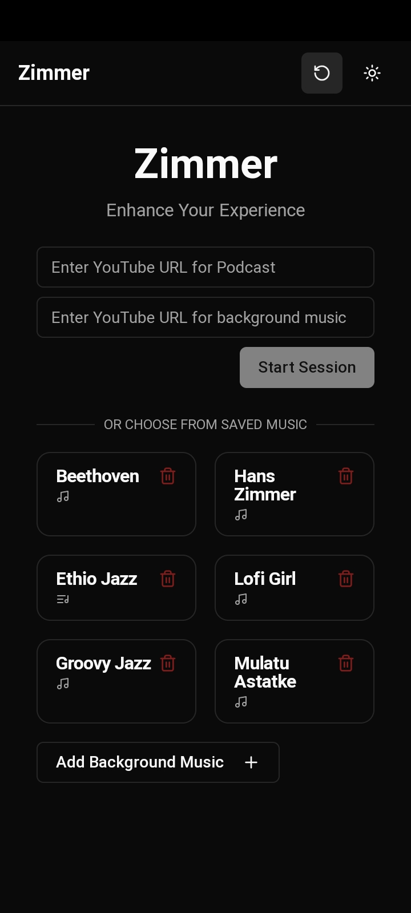
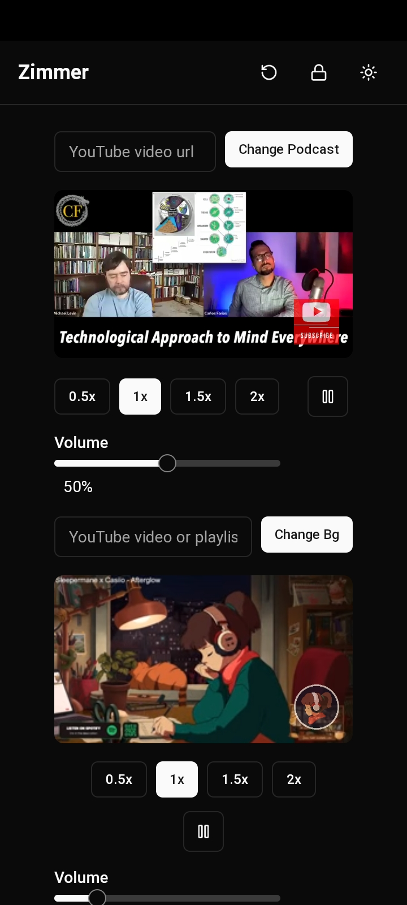

# Zimmer 🎧

Zimmer is a web app (PWA) that enhances your podcast listening experience by allowing you to play ambient background music alongside your favorite podcasts. Perfect for creating the right atmosphere while listening to your favorite content.

## Features

- 💾 Auto-save functionality for your last session
- 🎨 Clean, modern interface
- 🔒 Lock screen
- 📱 Responsive design for all devices

## Screenshots






## Technology Stack

- Built with SvelteKit
- Styled with Tailwind CSS
- Modern UI components with Shadcn-Svelte

## Getting Started

1. Clone the repository
2. Install dependencies:
   ```bash
   bun install
   ```
3. Run the development server:
   ```bash
   bun dev
   ```

## Usage

1. Enter the YouTube URL of your podcast
2. Choose your preferred background music
3. Adjust the volume levels to your liking
4. Enjoy your enhanced listening experience!
